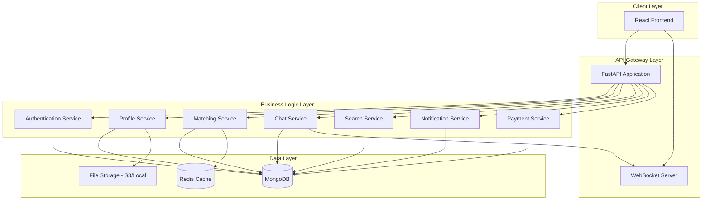
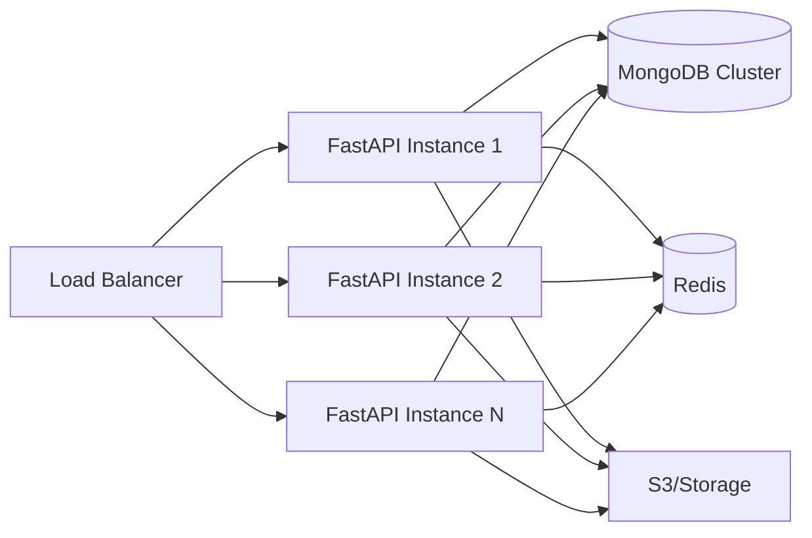

# Soulmate Connect - Backend API Design Document

## 📋 Executive Summary

This document outlines the backend architecture for **Soulmate Connect**, a matrimonial/matchmaking application. The backend will be built using **FastAPI** (Python) and **MongoDB** as the database, providing RESTful APIs for the React frontend.

---

## 🎯 Application Overview

Based on the frontend analysis, Soulmate Connect is a modern matrimonial platform with the following key features:

### Core Features
1. **User Authentication** - Registration, Login, Profile Management
2. **Profile Discovery** - Swipe-based matching (like/pass/super-like)
3. **Advanced Search** - Filter by location, education, religion, age, etc.
4. **Matching System** - Mutual likes create matches
5. **Real-time Chat** - Messaging between matched users
6. **Premium Features** - Subscription-based enhanced features
7. **Profile Verification** - Verified user badges
8. **Notifications** - Activity alerts and match notifications

---

## 🏗️ System Architecture



---

## 📊 Database Schema Design

### Collections Structure

#### 1. **users** Collection
```javascript
{
  _id: ObjectId,
  email: String (unique, indexed),
  phone: String (unique, indexed),
  password_hash: String,
  name: String,
  age: Number,
  gender: String (enum: 'male', 'female'),
  date_of_birth: Date,
  
  // Profile Details
  location: {
    city: String,
    state: String,
    country: String,
    coordinates: {
      type: "Point",
      coordinates: [longitude, latitude]
    }
  },
  religion: String,
  education: String,
  occupation: String,
  height: String,
  about: String,
  
  // Arrays
  photos: [String], // URLs to uploaded images
  interests: [String],
  looking_for: [String],
  
  // Status Flags
  verified: Boolean (default: false),
  premium: Boolean (default: false),
  premium_expires_at: Date,
  is_active: Boolean (default: true),
  profile_completion: Number (0-100),
  
  // Metadata
  last_active: Date,
  created_at: Date,
  updated_at: Date,
  
  // Preferences
  preferences: {
    age_range: {min: Number, max: Number},
    religion: [String],
    education: [String],
    location: [String],
    height_range: {min: Number, max: Number},
    max_distance: Number (km)
  }
}
```

#### 2. **swipes** Collection
```javascript
{
  _id: ObjectId,
  user_id: ObjectId (indexed),
  target_user_id: ObjectId (indexed),
  action: String (enum: 'like', 'pass', 'super_like'),
  created_at: Date,
  
  // Compound index on (user_id, target_user_id) for uniqueness
}
```

#### 3. **matches** Collection
```javascript
{
  _id: ObjectId,
  user1_id: ObjectId (indexed),
  user2_id: ObjectId (indexed),
  matched_at: Date,
  is_active: Boolean (default: true),
  last_message: String,
  last_message_at: Date,
  unread_count_user1: Number (default: 0),
  unread_count_user2: Number (default: 0),
  
  // Compound index on (user1_id, user2_id)
}
```

#### 4. **messages** Collection
```javascript
{
  _id: ObjectId,
  match_id: ObjectId (indexed),
  sender_id: ObjectId (indexed),
  receiver_id: ObjectId (indexed),
  content: String,
  message_type: String (enum: 'text', 'image', 'emoji'),
  read: Boolean (default: false),
  read_at: Date,
  created_at: Date,
  
  // Index on (match_id, created_at) for efficient querying
}
```

#### 5. **notifications** Collection
```javascript
{
  _id: ObjectId,
  user_id: ObjectId (indexed),
  type: String (enum: 'new_match', 'new_message', 'new_like', 'profile_view', 'super_like'),
  title: String,
  message: String,
  data: Object, // Additional context
  read: Boolean (default: false),
  created_at: Date,
  
  // Index on (user_id, created_at)
}
```

#### 6. **subscriptions** Collection
```javascript
{
  _id: ObjectId,
  user_id: ObjectId (indexed),
  plan_type: String (enum: 'basic', 'premium', 'gold'),
  status: String (enum: 'active', 'expired', 'cancelled'),
  start_date: Date,
  end_date: Date,
  payment_id: String,
  amount: Number,
  currency: String,
  created_at: Date,
  updated_at: Date
}
```

#### 7. **profile_views** Collection
```javascript
{
  _id: ObjectId,
  viewer_id: ObjectId (indexed),
  viewed_user_id: ObjectId (indexed),
  viewed_at: Date,
  
  // Compound index on (viewer_id, viewed_user_id, viewed_at)
}
```

#### 8. **reports** Collection
```javascript
{
  _id: ObjectId,
  reporter_id: ObjectId,
  reported_user_id: ObjectId,
  reason: String,
  description: String,
  status: String (enum: 'pending', 'reviewed', 'resolved'),
  created_at: Date,
  resolved_at: Date
}
```

---

## 🔌 API Endpoints Design

### Authentication & User Management

| Method | Endpoint | Description | Auth Required |
|--------|----------|-------------|---------------|
| POST | `/api/v1/auth/register` | User registration | No |
| POST | `/api/v1/auth/login` | User login | No |
| POST | `/api/v1/auth/logout` | User logout | Yes |
| POST | `/api/v1/auth/refresh` | Refresh access token | Yes |
| POST | `/api/v1/auth/forgot-password` | Request password reset | No |
| POST | `/api/v1/auth/reset-password` | Reset password | No |
| GET | `/api/v1/auth/me` | Get current user | Yes |

### Profile Management

| Method | Endpoint | Description | Auth Required |
|--------|----------|-------------|---------------|
| GET | `/api/v1/profiles/me` | Get own profile | Yes |
| PUT | `/api/v1/profiles/me` | Update own profile | Yes |
| POST | `/api/v1/profiles/photos` | Upload profile photo | Yes |
| DELETE | `/api/v1/profiles/photos/{photo_id}` | Delete profile photo | Yes |
| GET | `/api/v1/profiles/{user_id}` | Get user profile by ID | Yes |
| PUT | `/api/v1/profiles/preferences` | Update match preferences | Yes |

### Discovery & Matching

| Method | Endpoint | Description | Auth Required |
|--------|----------|-------------|---------------|
| GET | `/api/v1/discover` | Get profiles to discover | Yes |
| POST | `/api/v1/swipes` | Swipe on a profile (like/pass/super-like) | Yes |
| GET | `/api/v1/matches` | Get all matches | Yes |
| GET | `/api/v1/matches/{match_id}` | Get specific match details | Yes |
| DELETE | `/api/v1/matches/{match_id}` | Unmatch a user | Yes |
| GET | `/api/v1/likes/received` | Get users who liked you | Yes |

### Search

| Method | Endpoint | Description | Auth Required |
|--------|----------|-------------|---------------|
| GET | `/api/v1/search` | Search profiles with filters | Yes |
| GET | `/api/v1/search/suggestions` | Get search suggestions | Yes |

### Chat & Messaging

| Method | Endpoint | Description | Auth Required |
|--------|----------|-------------|---------------|
| GET | `/api/v1/conversations` | Get all conversations | Yes |
| GET | `/api/v1/conversations/{match_id}/messages` | Get messages for a match | Yes |
| POST | `/api/v1/conversations/{match_id}/messages` | Send a message | Yes |
| PUT | `/api/v1/conversations/{match_id}/read` | Mark messages as read | Yes |
| WebSocket | `/ws/chat/{user_id}` | Real-time chat connection | Yes |

### Notifications

| Method | Endpoint | Description | Auth Required |
|--------|----------|-------------|---------------|
| GET | `/api/v1/notifications` | Get all notifications | Yes |
| PUT | `/api/v1/notifications/{id}/read` | Mark notification as read | Yes |
| PUT | `/api/v1/notifications/read-all` | Mark all as read | Yes |
| DELETE | `/api/v1/notifications/{id}` | Delete notification | Yes |

### Premium & Subscriptions

| Method | Endpoint | Description | Auth Required |
|--------|----------|-------------|---------------|
| GET | `/api/v1/subscriptions/plans` | Get available plans | No |
| POST | `/api/v1/subscriptions/subscribe` | Subscribe to a plan | Yes |
| GET | `/api/v1/subscriptions/current` | Get current subscription | Yes |
| POST | `/api/v1/subscriptions/cancel` | Cancel subscription | Yes |

### Admin (Optional)

| Method | Endpoint | Description | Auth Required |
|--------|----------|-------------|---------------|
| GET | `/api/v1/admin/users` | Get all users | Admin |
| PUT | `/api/v1/admin/users/{id}/verify` | Verify a user | Admin |
| GET | `/api/v1/admin/reports` | Get all reports | Admin |
| PUT | `/api/v1/admin/reports/{id}` | Update report status | Admin |

---

## 🔐 Security & Authentication

### JWT-based Authentication
- **Access Token**: Short-lived (15-30 minutes), used for API requests
- **Refresh Token**: Long-lived (7-30 days), stored in HTTP-only cookie
- **Token Payload**: `{user_id, email, premium, verified, exp, iat}`

### Password Security
- Passwords hashed using **bcrypt** with salt rounds
- Minimum password requirements enforced

### API Security
- **Rate Limiting**: Prevent abuse (e.g., 100 requests/minute per user)
- **CORS**: Configured for frontend domain only
- **Input Validation**: Pydantic models for request validation
- **SQL Injection Prevention**: MongoDB queries are parameterized

---

## 🚀 Matching Algorithm

### Discovery Algorithm
```python
def get_discovery_profiles(user):
    # 1. Get user preferences
    # 2. Exclude already swiped users
    # 3. Filter by preferences (age, religion, location, etc.)
    # 4. Calculate compatibility score
    # 5. Sort by score and last_active
    # 6. Return top N profiles
```

### Compatibility Score Factors
- **Location proximity** (30%)
- **Shared interests** (25%)
- **Education level match** (15%)
- **Age preference match** (15%)
- **Religion match** (10%)
- **Profile completion** (5%)

---

## 💬 Real-time Features

### WebSocket Implementation
- **Connection**: User connects via `/ws/chat/{user_id}`
- **Authentication**: JWT token in query params or headers
- **Events**:
  - `message.new` - New message received
  - `message.read` - Message read receipt
  - `user.typing` - Typing indicator
  - `user.online` - Online status
  - `match.new` - New match notification

---

## 📁 File Upload Strategy

### Photo Upload
- **Storage**: AWS S3 or local filesystem
- **Validation**: 
  - Max size: 5MB per image
  - Allowed formats: JPEG, PNG, WebP
  - Max photos: 6 per profile
- **Processing**:
  - Resize to multiple sizes (thumbnail, medium, full)
  - Compress for optimization
  - Generate unique filenames

---

## 🔄 Caching Strategy

### Redis Caching
- **User sessions**: Store active sessions
- **Discovery feed**: Cache filtered profiles (5-10 min TTL)
- **Match counts**: Cache unread message counts
- **Rate limiting**: Track API request counts

---

## 📊 Analytics & Monitoring

### Key Metrics to Track
- Daily Active Users (DAU)
- Match rate
- Message response rate
- Swipe patterns (like/pass ratio)
- Premium conversion rate
- Profile completion rate

### Logging
- Request/Response logging
- Error tracking (Sentry integration)
- Performance monitoring (response times)

---

## 🧪 Testing Strategy

### Unit Tests
- Service layer logic
- Utility functions
- Data validation

### Integration Tests
- API endpoint testing
- Database operations
- Authentication flows

### Load Testing
- Concurrent user simulation
- Database query performance
- WebSocket connection limits

---

## 🚀 Deployment Architecture



### Infrastructure Components
- **Application Server**: FastAPI with Uvicorn (ASGI)
- **Database**: MongoDB Atlas (managed) or self-hosted replica set
- **Cache**: Redis (managed or self-hosted)
- **File Storage**: AWS S3 or DigitalOcean Spaces
- **Load Balancer**: Nginx or AWS ALB
- **Container**: Docker + Docker Compose
- **Orchestration**: Kubernetes (optional for scale)

---

## 📦 Technology Stack

### Backend Framework
- **FastAPI** - Modern, fast Python web framework
- **Pydantic** - Data validation
- **Motor** - Async MongoDB driver
- **PyJWT** - JWT authentication
- **Passlib** - Password hashing
- **Python-multipart** - File uploads
- **WebSockets** - Real-time communication

### Database
- **MongoDB** - NoSQL database for flexible schema
- **Redis** - Caching and session management

### DevOps
- **Docker** - Containerization
- **Docker Compose** - Local development
- **GitHub Actions** - CI/CD
- **Pytest** - Testing framework

---

## 📝 Environment Variables

```env
# Application
APP_NAME=Soulmate Connect API
APP_VERSION=1.0.0
DEBUG=False
ENVIRONMENT=production

# Database
MONGODB_URL=mongodb://localhost:27017
MONGODB_DB_NAME=soulmate_connect

# Redis
REDIS_URL=redis://localhost:6379

# JWT
JWT_SECRET_KEY=your-secret-key-here
JWT_ALGORITHM=HS256
ACCESS_TOKEN_EXPIRE_MINUTES=30
REFRESH_TOKEN_EXPIRE_DAYS=7

# File Storage
UPLOAD_DIR=./uploads
MAX_UPLOAD_SIZE=5242880
ALLOWED_EXTENSIONS=jpg,jpeg,png,webp

# AWS S3 (if using)
AWS_ACCESS_KEY_ID=
AWS_SECRET_ACCESS_KEY=
AWS_S3_BUCKET=
AWS_REGION=

# Email (for notifications)
SMTP_HOST=
SMTP_PORT=
SMTP_USER=
SMTP_PASSWORD=

# Payment Gateway
RAZORPAY_KEY_ID=
RAZORPAY_KEY_SECRET=

# CORS
CORS_ORIGINS=http://localhost:5173,https://yourdomain.com
```

---

## 🎯 Project Structure

```
backend/
├── app/
│   ├── __init__.py
│   ├── main.py                 # FastAPI app entry point
│   ├── config.py               # Configuration settings
│   ├── database.py             # MongoDB connection
│   ├── dependencies.py         # Dependency injection
│   │
│   ├── api/
│   │   ├── __init__.py
│   │   └── v1/
│   │       ├── __init__.py
│   │       ├── auth.py         # Auth endpoints
│   │       ├── profiles.py     # Profile endpoints
│   │       ├── discover.py     # Discovery endpoints
│   │       ├── matches.py      # Match endpoints
│   │       ├── chat.py         # Chat endpoints
│   │       ├── search.py       # Search endpoints
│   │       ├── notifications.py
│   │       └── subscriptions.py
│   │
│   ├── models/
│   │   ├── __init__.py
│   │   ├── user.py             # User model
│   │   ├── match.py            # Match model
│   │   ├── message.py          # Message model
│   │   └── notification.py
│   │
│   ├── schemas/
│   │   ├── __init__.py
│   │   ├── user.py             # Pydantic schemas
│   │   ├── auth.py
│   │   ├── match.py
│   │   └── message.py
│   │
│   ├── services/
│   │   ├── __init__.py
│   │   ├── auth_service.py
│   │   ├── profile_service.py
│   │   ├── matching_service.py
│   │   ├── chat_service.py
│   │   ├── notification_service.py
│   │   └── upload_service.py
│   │
│   ├── utils/
│   │   ├── __init__.py
│   │   ├── security.py         # JWT, password hashing
│   │   ├── validators.py
│   │   └── helpers.py
│   │
│   └── websockets/
│       ├── __init__.py
│       └── chat.py             # WebSocket handlers
│
├── tests/
│   ├── __init__.py
│   ├── test_auth.py
│   ├── test_profiles.py
│   └── test_matching.py
│
├── migrations/                 # Database migrations
├── uploads/                    # Local file uploads
├── .env                        # Environment variables
├── .env.example
├── requirements.txt
├── Dockerfile
├── docker-compose.yml
└── README.md
```

---

## 🔄 Development Workflow

### Phase 1: Foundation (Week 1-2)
- [ ] Project setup and structure
- [ ] MongoDB connection and models
- [ ] Authentication system (JWT)
- [ ] User registration and login
- [ ] Profile CRUD operations

### Phase 2: Core Features (Week 3-4)
- [ ] Discovery algorithm
- [ ] Swipe functionality
- [ ] Matching system
- [ ] Search with filters
- [ ] File upload for photos

### Phase 3: Communication (Week 5)
- [ ] Chat API endpoints
- [ ] WebSocket implementation
- [ ] Real-time messaging
- [ ] Notifications system

### Phase 4: Premium Features (Week 6)
- [ ] Subscription management
- [ ] Payment integration
- [ ] Premium feature gates
- [ ] Analytics tracking

### Phase 5: Testing & Deployment (Week 7-8)
- [ ] Unit and integration tests
- [ ] Load testing
- [ ] Docker containerization
- [ ] Deployment setup
- [ ] Documentation

---

## 📈 Scalability Considerations

### Database Optimization
- **Indexes**: Create indexes on frequently queried fields
- **Sharding**: Horizontal scaling for large datasets
- **Read Replicas**: Distribute read operations

### Application Scaling
- **Horizontal Scaling**: Multiple FastAPI instances behind load balancer
- **Async Operations**: Use async/await for I/O operations
- **Background Jobs**: Celery for heavy tasks (email, notifications)

### Caching
- **Query Results**: Cache expensive queries
- **Session Data**: Store in Redis
- **CDN**: Serve static assets and images

---

## 🎉 Conclusion

This backend design provides a robust, scalable foundation for the Soulmate Connect matrimonial application. The architecture leverages modern technologies (FastAPI, MongoDB) to deliver high performance, real-time features, and excellent developer experience.

### Next Steps
1. Review and approve this design
2. Set up development environment
3. Begin Phase 1 implementation
4. Iterate based on frontend requirements

---

**Document Version**: 1.0  
**Last Updated**: 2025-12-31  
**Author**: Backend Architecture Team
